# Ghostty for iOS

An SSH-first terminal for iPhone and iPad whose terminal emulation is
Ghostty's own.

## Why this shape

Upstream Ghostty removed its iOS app target. What still builds for iOS is
**libghostty-vt** — see `src/build/Config.zig`, which gates the iOS target down
to the VT library alone. That library is the terminal: the escape-sequence
parser, the screen and scrollback, reflow on resize, render state, and the key,
mouse and paste encoders. It is deliberately *not* a terminal application: it
has no pty, no renderer, no shell.

Two of those three are ours to supply, and the third cannot exist. iOS has no
shell and no `fork`. So the far end of this terminal is always a **network**:
an SSH channel to a machine that does have a shell. That is not a compromise
around the platform, it is the only honest design for a terminal on iOS — and
it means the app needs a real vault of SSH identities and pinned host keys, not
a settings toggle.

```
┌──────────────────────────────────────────────────────────────┐
│ SwiftUI app  (Sources/App)                                   │
│   Hosts · Sessions · Console · Keys · Settings                │
│   TOFU + password alerts · Sync settings · Haptics            │
└───────────────┬──────────────────────────────┬───────────────┘
                │                              │
┌───────────────▼──────────────┐  ┌────────────▼───────────────┐
│ TerminalView (UIKit)         │  │ Vault (Sources/Vault)      │
│  · CoreText grid, dirty-row  │  │  · Identity / Host /       │
│    redraw, selection, pinch  │  │    KnownHost metadata JSON │
│  · UIKeyInput + pressesBegan │  │  · Keychain-only secrets   │
│  · mobile key bar            │  │  · openssh-key-v1 parser   │
└───────────────┬──────────────┘  │  · pure TOFU policy        │
                │                 └────────────┬───────────────┘
      ┌─────────▼─────────┐                    │
      │ TerminalSession   │                    │
      │  bytes in ⇄ out   │                    │
      └────┬─────────┬────┘                    │
           │         │                         │
 ┌─────────▼──┐  ┌───▼────────────────┐        │
 │ GhosttyVT  │  │ TerminalTransport  │        │
 │ (C wrapper)│  ├────────────────────┤        │
 │            │  │ SSHTransport ──────┼────────┤
 │  libghostty│  │ ConsoleTransport   │   (keys, passwords,
 │  -vt .a    │  └────────┬───────────┘    host-key pins)
 └────────────┘           │                     │
                          │          ┌──────────▼──────────────┐
                          │          │ VaultSyncEngine         │
                          │          │  newest-wins merge      │
                          │          ├─────────────────────────┤
                          │          │ iCloud Keychain         │
                          │          │ Bitwarden / Vaultwarden │
                          │          │ 1Password Connect       │
                          │          │ Encrypted bundle        │
                          │          └─────────────────────────┘
                  ┌───────▼────────┐
                  │ SSHSession     │  swift-nio-ssh (morton-patches)
                  │  pty-req/shell │  Curve25519 · P-256/384/521 · RSA
                  │  window-change │  Secure Enclave P-256 · certificates
                  └────────────────┘
```

Bytes off the SSH channel go into `ghostty_terminal_vt_write`. Key presses go
through `ghostty_key_encoder_encode`, with the encoder's options refreshed from
the terminal (`ghostty_key_encoder_setopt_from_terminal`) before **every**
keystroke — a program can enable application cursor keys or the Kitty keyboard
protocol at any moment and the very next key has to honour it. Resize is
`ghostty_terminal_resize` plus an SSH `window-change`. Paste goes through
`ghostty_paste_encode`, honouring bracketed-paste mode, with
`ghostty_paste_is_safe` deciding whether to warn first.

## Building

```bash
# 1. Build and stage libghostty-vt as an XCFramework (~5-10 min; reuses an
#    existing zig-out build unless you pass --force).
./build-libvt.sh

# 2. Generate the Xcode project. Xcode resolves the SwiftPM packages over the
#    network on first open/build.
xcodegen generate

# 3. Build and test.
xcodebuild build -scheme Ghostty -project Ghostty.xcodeproj \
  -destination 'generic/platform=iOS Simulator' \
  -derivedDataPath /tmp/ghosttybuild CODE_SIGNING_ALLOWED=NO

xcodebuild test -scheme Ghostty -project Ghostty.xcodeproj \
  -destination 'platform=iOS Simulator,name=iPhone 17' \
  -derivedDataPath /tmp/ghosttybuild CODE_SIGNING_ALLOWED=NO
```

`Frameworks/` is gitignored — the xcframework is a build artifact, not source.

The SSH transport is **`and-haynes/swift-nio-ssh`, branch `morton-patches`**,
pinned in `project.yml` as a branch dependency rather than upstream's 0.15.
Upstream cannot do RSA keys, SSH certificates, or any cipher or MAC whose key is
wider than the key-exchange hash, and none of it is reachable from outside the
module — the key types wrap private enums and the algorithm lists are hardcoded.
The section below says what the branch changes.

Two build settings are load-bearing and both were learned the hard way:

* **No explicit `HEADER_SEARCH_PATHS` for the xcframework.** Xcode adds the
  matching slice's `Headers` directory itself. Adding it again makes clang read
  `module.modulemap` twice and fail with *Redefinition of module 'GhosttyVt'*.
* **`EXCLUDED_ARCHS[sdk=iphonesimulator*] = x86_64`.** The xcframework ships
  `ios-arm64` and `ios-arm64-simulator` only, so an x86_64 simulator slice has
  nothing to link against.

## Which algorithms this app can negotiate

Upstream swift-nio-ssh ships two ciphers — `aes128-gcm@openssh.com` and
`aes256-gcm@openssh.com` — and nothing else, which is fine against a modern
OpenSSH and useless against a router, a NAS appliance or a Dropbear box. Those
offer AES-CTR with an HMAC, share no cipher with the stock client, and fail the
handshake with `NIOSSHError.keyExchangeNegotiationFailure` and no further
explanation.

`Sources/SSH/Transport/` adds `aes256-ctr`, `aes192-ctr` and `aes128-ctr` paired
with `hmac-sha2-256` and `hmac-sha2-512`, in both RFC 4253's MAC-then-encrypt
ordering and OpenSSH's `-etm@openssh.com` encrypt-then-MAC one, and
`chacha20-poly1305@openssh.com`. AES-CTR comes from CommonCrypto used as an ECB
block oracle with the counter kept in Swift; the HMACs are CryptoKit; the ChaCha
and Poly1305 are ours, against RFC 8439 vectors. GCM stays first in the offer —
it is hardware-accelerated on every device this runs on, and nothing that worked
yesterday should negotiate something weaker today.

| | Supported |
|---|---|
| Key exchange | `ecdh-sha2-nistp384`, `ecdh-sha2-nistp256`, `ecdh-sha2-nistp521`, `curve25519-sha256` — the library's list, which has no extension point |
| Host keys | `ssh-ed25519`, `ecdsa-sha2-nistp384/256/521`, `rsa-sha2-512`, `rsa-sha2-256`, plus the six `*-cert-v01@openssh.com` equivalents — the certificate names first, and only when a CA is configured |
| Ciphers | `aes256-gcm@openssh.com`, `aes128-gcm@openssh.com`, `chacha20-poly1305@openssh.com`, `aes256-ctr`, `aes192-ctr`, `aes128-ctr` |
| MACs | `hmac-sha2-512-etm@openssh.com`, `hmac-sha2-512`, `hmac-sha2-256-etm@openssh.com`, `hmac-sha2-256` (an AEAD negotiates none) |

**Why the fork.** Three of those rows used to be shorter, and the reasons were
all upstream's. swift-nio-ssh 0.15 derived session keys by truncating a *single*
key-exchange hash rather than running RFC 4253 §7.2's expansion loop, so it
could never produce more key material than that hash was long: 32 bytes under
`curve25519-sha256` and `ecdh-sha2-nistp256`, 48 under `ecdh-sha2-nistp384`, 64
only under `ecdh-sha2-nistp521`. `hmac-sha2-512` and
`chacha20-poly1305@openssh.com` both need a 64-byte key, so both were
implemented, tested, and offered only after a probe confirmed the exchange would
be `ecdh-sha2-nistp521`. chacha20-poly1305 had a second, independent blocker:
`NIOSSHTransportProtection.decryptFirstBlock(_:)` must leave the packet length in
plaintext and was handed no sequence number — but the sequence number *is* the
nonce the length was encrypted under. RSA was not expressible at all:
`NIOSSHPublicKey` and `NIOSSHPrivateKey` wrap private enums with a closed set of
cases, and `supportedServerHostKeyAlgorithms` was a hardcoded `static let` of
four names. And a certificate could be parsed but never negotiated, because no
`*-cert-v01@openssh.com` name appeared in either the host key list or the list
that gates user authentication parsing.

`morton-patches` fixes all four: the §7.2 expansion loop, a sequence number on
`decryptFirstBlock`, an `.rsa` case on both key types backed by
Security.framework, and the certificate algorithm names in both lists. So
`hmac-sha2-512` and `chacha20-poly1305@openssh.com` are now offered on every
connection rather than behind a probe; `hmac-sha2-512` now sits ahead of
`hmac-sha2-256`, which it was only behind because it could not be keyed; and
`ChaCha20Poly1305TransportProtection` wraps the vector-tested
`ChaCha20Poly1305OpenSSH` construction as a real `NIOSSHTransportProtection`.

What is still out of reach, and deliberately so in most cases:

* **`ssh-rsa`** is never asked for. It signs with SHA-1, which OpenSSH has
  refused since 8.8; only `rsa-sha2-512` and `rsa-sha2-256` are offered. A key a
  server insists on sending under `ssh-rsa` anyway can still be verified.
* **`ssh-dss`** is not implemented. OpenSSH removed DSA in 9.8.
* **Finite-field Diffie-Hellman** (`diffie-hellman-group*`) is unimplemented,
  and the fork added no key exchange algorithms, so a server old enough to offer
  only that is still unreachable.
* **Generating an RSA key in the app** is deliberately absent. RSA keys are
  imported, used and exported; new ones are Ed25519 or ECDSA.
* **Serving** a host certificate is not a thing a client does, and this is only
  ever a client.

`Tests/local-sshd.sh` (`start`, `stop`, `status`) brings up real `sshd`
instances on loopback, and the app has run a real session over each of the new
paths against them: an RSA-only host key, `chacha20-poly1305@openssh.com`,
`hmac-sha2-512`, a user certificate against a server set to
`AuthorizedKeysFile none` — where the certificate is the only way in — and a
CA-signed host certificate, with no first-use prompt and nothing pinned. The
negative cases run there too: a host certificate from an untrusted CA is refused
and never falls through to trust-on-first-use, and the bare key alone is refused
by the certificate-only server.

### When it still cannot connect

A server announces its whole algorithm menu in the clear, before anything is
negotiated or authenticated. So when a handshake fails on negotiation, the app
goes and reads it: `SSHServerProbe` takes the banner and `SSH_MSG_KEXINIT`, and
`SSHAlgorithmMismatch` does the comparison the library threw away — which of the
four negotiations failed, what each side offered, what is missing, and the fix.
A host key offered under `ssh-rsa` alone, a DSA-only host key and finite-field
Diffie-Hellman each get their own sentence.

The same machinery is a button: **Test connection**, in the host editor. It
reports reachability, the banner, the whole offer, what would be negotiated, and
the host key fingerprint. It offers a credential only when that fingerprint is
already pinned and matches — a diagnostic that sends your password to whatever
answered the port is worse than no diagnostic — and it never starts a shell or
runs a command.

## Security model of the vault

| Thing | Where it lives |
|---|---|
| Private keys | Keychain, `kSecAttrAccessibleWhenUnlockedThisDeviceOnly` |
| Biometry-protected keys | Keychain + `SecAccessControl(.biometryCurrentSet)` |
| Secure Enclave keys | Inside the Enclave; the Keychain holds only a reference blob |
| Host passwords | Keychain, same protection class |
| Public keys, fingerprints, host metadata, known-hosts pins | JSON in Application Support, written atomically |

A filesystem dump of the app container therefore leaks host names and public
keys and nothing else. Keychain access goes through a `KeychainStore` protocol
so tests use an in-memory implementation — the simulator's real Keychain leaks
state across runs, and biometry and the Enclave are not testable there at all.

**iCloud Keychain sync is opt-in and off by default**, and is *refused* rather
than ignored for Secure Enclave and biometry-protected keys: a Secure Enclave
key is a reference to one specific chip and a `.biometryCurrentSet` policy is
bound to this device's enrolled biometrics. Honouring the toggle would leave
the metadata claiming a protection the stored item does not have.

**Host keys are pinned trust-on-first-use.** The first connection to an
endpoint stops the handshake and shows the key type and the OpenSSH-format
`SHA256:` fingerprint for a human to check (`ssh-keygen -lf
/etc/ssh/ssh_host_ed25519_key.pub` on the server). A key that does *not* match
an existing pin fails the handshake outright — there is deliberately no "accept
anyway" button, because that button is how pinning stops meaning anything. The
pin can be removed explicitly from **Keys ▸ Known hosts**, which is the
supported way to handle a re-imaged box.

## SSH certificates

An OpenSSH certificate is a public key plus a CA's signature over a key ID, a
serial, a list of principals, a validity window, extensions and critical
options. It removes the two pieces of per-host bookkeeping this app otherwise
does by hand — an `authorized_keys` line per key per host, and a pin per host.
Both halves are supported.

**User certificates** are imported next to the key they certify: **Keys ▸
a key ▸ Certificate ▸ Import certificate**, pasting the `<key>-cert.pub` that
`ssh-keygen -s` writes. The import screen shows the key ID, serial, principals,
validity, extensions, critical options and the signing CA's fingerprint, and
refuses a certificate that does not certify that key. Once attached it is
offered automatically on every connection, *before* the bare key — and the bare
key is still offered behind it, so attaching a certificate cannot break a host
that admits the key through `authorized_keys` and has never heard of the CA.

**Host certificates** are checked against CA public keys pasted into **Settings
▸ SSH certificates**, one per line — the equivalent of an `@cert-authority` line
in `known_hosts`. A host that presents a certificate is then not pinned at all:
the certificate must be signed by one of those CAs, be a host certificate rather
than a user one, name the host among its principals, be inside its validity
window, and carry no critical option the app does not understand. Certificates
are never pinned, because a certificate's fingerprint changes every time the CA
re-signs the same host key — the routine event a short validity window exists to
cause.

The `*-cert-v01@openssh.com` host key algorithms are offered **only when a CA is
configured**. With none, the app does not ask for a certificate at all, a
certified host presents its plain key, and trust-on-first-use behaves exactly as
it always did. Asking for a certificate the app has no CA to check would turn a
working TOFU connection into a failure.

## Getting a key in from 1Password

1Password has no on-device API for third-party iOS apps, so the only route for a
key stored there is to copy it across by hand. **Keys ▸ Import key from
clipboard** makes that one tap: the button appears whenever the clipboard holds
a string, the contents are read only when it is pressed (so the system paste
banner appears once, and only after the user asked), the key's own comment
prefills the name where the format has one, and the clipboard is wiped as soon
as the key is in the Keychain — a private key left on the pasteboard is readable
by the next app opened, and by any Mac on the same iCloud account.

**Keys ▸ Import from 1Password…** is the six-step guide, and points at the
1Password Connect sync provider for the automatic route.

## Vault sync

Four providers behind one `VaultSyncProvider` protocol. Providers push and pull
whole snapshots and know nothing about conflict resolution — `VaultSyncEngine`
owns the single policy so every provider behaves identically and the rule
itself is testable without a network.

**The conflict rule is newest-wins at snapshot granularity.** Records are
unioned by id; where the same id exists on both sides, the newer snapshot's
copy is kept. This is deliberately coarse: `Identity`, `Host` and `KnownHost`
carry no per-record modification time, and inventing one would mean rewriting
records the user never touched. Additions and deletions on either side always
survive; editing *the same host* on two devices between syncs loses the older
edit. Per-record timestamps are a TODO.

**Secure Enclave keys are never synced by any provider.** They travel as
metadata with a `device-only` flag so the other device can see the key exists
and why it is unusable there, rather than silently missing a host's credential.

| Provider | What it needs | Where things go |
|---|---|---|
| **iCloud Keychain** | Nothing — the device's iCloud account | Private keys already replicate as `kSecAttrSynchronizable` Keychain items; this adds the non-secret half (hosts, pins, key metadata) as one synchronised Keychain item |
| **Bitwarden / Vaultwarden** | Server URL + email/master password (+ TOTP), or API key + master password | Keys as native **SSH key items** (cipher type 5); hosts and pins as one secure note, `Ghostty iOS hosts` |
| **1Password Connect** | Connect server URL + token | Keys as **SSH_KEY** items; hosts and pins as a **SECURE_NOTE**, `Ghostty iOS hosts` |
| **Encrypted bundle** | A passphrase | One AES-GCM file you move yourself, via the share sheet or Files |

The Bitwarden client does the real client-side crypto: `prelogin` for KDF
parameters, PBKDF2-SHA256 master key, HKDF stretch, unwrap of the user
symmetric key, and AES-256-CBC + HMAC-SHA256 `EncString` type 2 with the MAC
verified in constant time *before* decryption. The master password never leaves
the device; only a one-iteration hash of it is sent, exactly as the official
clients do.

**1Password has no on-device API for third-party apps** — no extension, no
local vault access, nothing an iOS app may call. Connect is a REST server you
host yourself, and it is the only supported route. This is stated in the app's
own Settings help text too, so nobody wastes an afternoon looking for the
integration that does not exist.

The encrypted bundle is the generic path for everything else (KeePass, Proton
Pass, …): one file, one passphrase, moved by hand.

## The Console tab

iOS has no shell, so the Console is not one — it is the app's own command line,
running on the same libghostty-vt emulator an SSH session uses. It is a
permanent tab because its real job is `ssh`:

```
ssh [user@]host [-p port] [-i identity-name]
```

The host resolves against the vault by alias or hostname, so `ssh noether`
inherits that host's key, TERM, font size and startup command; an unrecognised
name connects ad-hoc without being saved. Also `help`, `hosts`, `keys`, `echo`,
`demo`, `history` and `clear`. Unknown commands print a hint rather than an
error.

## The key bar

`[Esc Tab Ctrl Alt] | [arrows · symbols · Home/End/PgUp/PgDn · Fn] | [paste ⌨]`

The keys you reach for without looking are pinned; everything else scrolls
between them, so muscle memory survives a scroll position. **Ctrl and Alt are
tri-state**: one tap arms for the next key, a second tap within 400 ms locks
until tapped off (a phone gives you one thumb, so "hold ctrl and press c" has
to become two taps, and a lock is what makes `ctrl-a ctrl-d` bearable). Arrows
are one cluster with press-and-hold auto-repeat. F1–F12 hide behind an `Fn`
toggle so they do not push everything useful off the end.

The keyboard toggle uses the real `keyboard.chevron.compact.down` symbol, and
when the bar is collapsed a floating `keyboard` button appears bottom-right of
the terminal — the way back is always one tap away.

## Selection, and the edit menu

A long press means two different things, decided by whether the finger moves:

* **Hold still** → the standard iOS edit menu at the touch point: Paste, Copy
  (when there is a selection), Select All, Select Word, and Select Input /
  Select Output. A two-finger tap opens the same menu, which is the convention
  other terminal apps use and the only route when a hardware keyboard is
  attached. The menu's items are UIKit's own, not look-alikes, so tapping
  **Paste** is treated as user-initiated and does not raise the *Allow Paste?*
  alert.
* **Hold, then drag** → a selection anchored on the word under the press, with
  the selection helper: translucent bands behind the **input** (the current
  command line) and the **output** (the previous command's), plus
  `Input · Output · Both` chips near your finger. Tapping a chip sets that exact
  selection; your own drag keeps working untouched, because the chips are
  sibling views rather than a gesture and a finger already owned by the drag
  stays owned by it. The chip bar passes through every touch that is not on a
  chip, so it can never steal the gesture underneath it.

The threshold between the two is 12 points, which is roughly the slop
`UILongPressGestureRecognizer` already tolerates — a resting finger rolls, and
that must not read as a drag. The arbitration is a value type
(`LongPressArbiter`) precisely so it can be tested without a touch.

With OSC 133 shell integration the ranges come from real prompt marks and the
chips use `ghostty_terminal_select_line` / `ghostty_terminal_select_output`,
which trim the prompt itself and take a wrapped command whole. Without it the
input is the cursor row and the output is everything above it in the viewport —
a suggestion that is sometimes approximate is far more useful than one that
only appears for people who have configured their shell.

## Haptics

One `Haptics` service, named by *event* rather than by generator, because the
mapping from "a connection came up" to "success notification" is a design
decision that belongs in one place. Impact (light/medium/rigid/soft), selection
and notification generators are kept warm ahead of gestures; the terminal bell
gets its own CoreHaptics pattern so `BEL` is distinguishable from every other
buzz the app makes.

**Settings ▸ Input ▸ Haptics** is Off / Subtle / Normal / **Rich**, default
Normal. Subtle keeps only events that happened on their own (connections,
errors, the bell) and scales impacts down; Normal adds keys, modifiers and the
keyboard toggle; Rich adds arrow repeats and per-cell selection ticks.

Three rules the call sites do not have to think about: one buzz per event (a
rate limiter collapses bursts), nothing while the app is backgrounded, and
nothing at all when it is off. Scrolling terminal output is deliberately silent.

## Feature matrix

### Done

| Area | |
|---|---|
| Terminal | Full libghostty-vt emulation: VT/ANSI parsing, scrollback, reflow on resize, alternate screen, modes |
| Rendering | CoreText grid, dirty-row incremental redraw, 256-colour + truecolour, bold/italic/faint/inverse/invisible, underline (single/double/dotted/dashed), strikethrough, overline, wide (CJK) cells, grapheme clusters |
| Cursor | Block / bar / underline / hollow, visibility and blink state from the terminal |
| Themes | Ghostty default, Catppuccin Mocha, Gruvbox Dark, Solarized Dark, Nord — applied through the terminal so OSC 4/10/11/104 still work |
| Input | Software keyboard via `UIKeyInput`; hardware keyboard via `pressesBegan` (modifiers, arrows, Esc, F1–F12, Home/End/PgUp/PgDn) |
| Key bar | Fixed Esc/Tab/Ctrl/Alt group, scrolling middle (arrow cluster with auto-repeat, symbols, Home/End/PgUp/PgDn, F1–F12 behind `Fn`), fixed paste + keyboard toggle; tri-state sticky/locked modifiers; floating keyboard button when collapsed |
| Console | Permanent tab with `ssh`, `hosts`, `keys`, `echo`, `demo`, `history`, `help`, `clear`; resolves hosts against the vault |
| Selection helper | Input/output bands and `Input · Output · Both` chips on long-press, OSC 133 aware with a cursor-based fallback |
| Sync | iCloud Keychain, Bitwarden/Vaultwarden, 1Password Connect, encrypted bundle; newest-wins merge; per-provider status in Settings |
| Haptics | Off/Subtle/Normal/Rich, ~25 mapped events, CoreHaptics bell, rate-limited, silent in the background |
| Gestures | Pinch to resize the font, pan to scroll the viewport through scrollback, long-press-and-drag to select, stationary long-press or two-finger tap for the edit menu (Copy / Paste / Select All / Select Word / Select Input / Select Output) |
| Paste | Bracketed-paste aware, unsafe-paste confirmation |
| SSH | Connect, host key verification (pinned trust-on-first-use, or a CA-signed host certificate), `pty-req` (configurable TERM), `env`, `shell` or `exec`, `window-change`, clean disconnect, bounded reconnect with backoff |
| Ciphers | `aes256-gcm@openssh.com`, `aes128-gcm@openssh.com`, `chacha20-poly1305@openssh.com`, and `aes256/192/128-ctr` with `hmac-sha2-512` or `hmac-sha2-256` in both the plain and `-etm@openssh.com` orderings — so servers with no AEAD (routers, NAS boxes, Dropbear) are reachable |
| Diagnostics | **Test connection** in the host editor: banner, the server's whole algorithm list, what would be negotiated, the host key fingerprint, and whether the credentials work — without opening a shell. A failed negotiation explains itself in plain language instead of `keyExchangeNegotiationFailure` |
| Auth | Password (stored or prompted), public key: Ed25519, ECDSA P-256/384/521, RSA (`rsa-sha2-512`/`rsa-sha2-256`), **Secure Enclave P-256**, and an OpenSSH certificate attached to any of them |
| Keys | Generate in-app (Ed25519, ECDSA, Secure Enclave — not RSA); import unencrypted OpenSSH, PKCS#8, PKCS#1 RSA and SEC 1 EC keys from the clipboard, a paste or Files; export/copy/share the public line, delete with confirmation, SHA256 fingerprints |
| Certificates | Import a user certificate beside its key, with key ID, serial, principals, validity, extensions, critical options and the CA's fingerprint shown before import, offered ahead of the bare key; CA public keys in Settings, against which a host certificate is checked for signature, type, principal, validity and critical options instead of being pinned |
| 1Password | One-tap **Import key from clipboard** when the clipboard holds a key, an in-app guide for getting one out of 1Password, and the clipboard wiped once the key is in the Keychain |
| Vault | Hosts with alias/group/tags/colour/TERM/font size/startup command/notes, known-hosts list with forget |
| Tests | 362 unit tests (including NIST, RFC 4231 and RFC 8439 crypto vectors, key-format and certificate fixtures from `ssh-keygen`/`openssl`, and integration tests against the real `sshd` instances `Tests/local-sshd.sh` starts) + UI tests that drive the real app and capture the screenshots below |

### Partial

* **RSA keys can only be imported, not generated.** An RSA key imported from
  any of the four encodings authenticates a connection, and an RSA host key is
  verified, both under `rsa-sha2-512` or `rsa-sha2-256`. What the app will not
  do is make a *new* RSA key: the types it generates are Ed25519, ECDSA and
  Secure Enclave P-256.
* **Mouse reporting** — the encoder is wired (`VTMouseEncoder`, synced from
  terminal state) but no gesture currently forwards events to it, so programs
  that turn on mouse tracking see nothing. The seam is there; the gesture
  routing is not.
* **Sync conflict resolution** is newest-wins per *snapshot*, not per record —
  see the Vault sync section. Simultaneous edits to the same host on two
  devices lose the older one.
* **Argon2id KDF** for Bitwarden accounts and for the encrypted bundle is
  stubbed behind a protocol with a clear error; PBKDF2 (which is what
  Vaultwarden's default is) is the shipped path. Wiring
  `tmthecoder/Argon2Swift` is a package addition away.
* **Selection** — long-press-and-drag works and copies correctly. There are no
  draggable selection handles, and rectangular selection is not exposed.
* **Curly underline** is drawn as a solid underline.
* **Reconnect** retries transport failures with backoff, but does not reattach
  to a remote session — if the far end's shell died, it died. Use `tmux`.
* **Session persistence** — sessions live only as long as the app process.

### TODO / not supported

* **Encrypted private key import.** A passphrase-protected key is refused with
  the command that fixes it (`ssh-keygen -p -N "" -f key`); the bcrypt-KDF +
  aes256-ctr path is unimplemented. The format is detected without the
  passphrase, so the message is specific rather than "malformed key".
* **keyboard-interactive auth.** swift-nio-ssh 0.15.0 exposes only
  `privateKey`, `password`, `hostBased` and `none`. A server that offers
  *only* keyboard-interactive is reported as such rather than failing vaguely.
* **Jump hosts / ProxyJump.** Marked `// TODO(jump host)` in `SSHSession.swift`
  with the concrete shape (a `.directTCPIP` child channel running the same
  pipeline).
* **mosh.** Would need a UDP datagram protocol and a state-sync implementation;
  out of scope.
* **Port forwarding, SFTP, agent forwarding.**
* **IME / marked text.** `UIKeyInput` is implemented, full `UITextInput` is
  not, so CJK composition does not work.
* **Split panes and tabs** — one terminal per session, sessions in a list.
* **Sync deletions do not propagate.** A record removed on one device
  reappears from the other's copy; only additions and edits travel.

## Screenshots

Captured by `Tests/GhosttyUITests/ScreenshotTests.swift` driving the real app
on an iPhone 17 simulator.

| | |
|---|---|
| 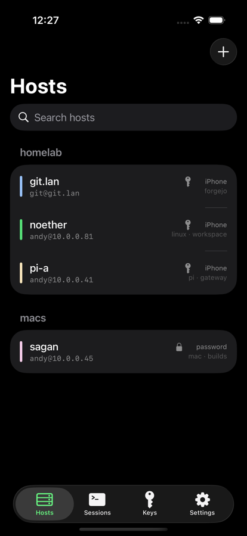 | 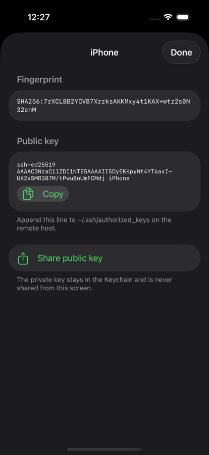 |
| Hosts, grouped, with per-host accent colours | A key generated in-app, with its `authorized_keys` line |
| 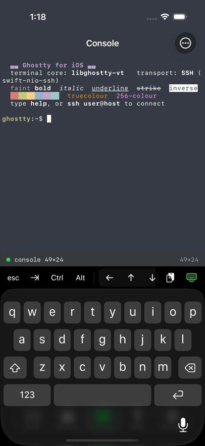 | 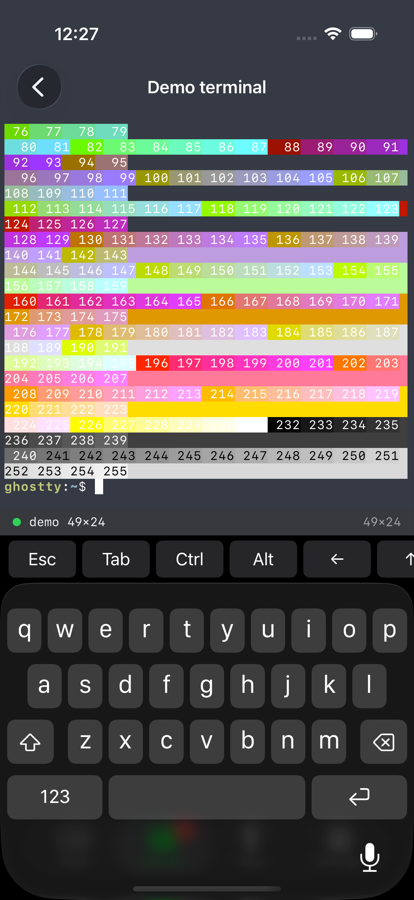 |
| The demo terminal: real VT rendered by libghostty-vt — bold, italic, underline, strikethrough, inverse, truecolour | Key bar above the keyboard, 256-colour chart echoed locally |
| 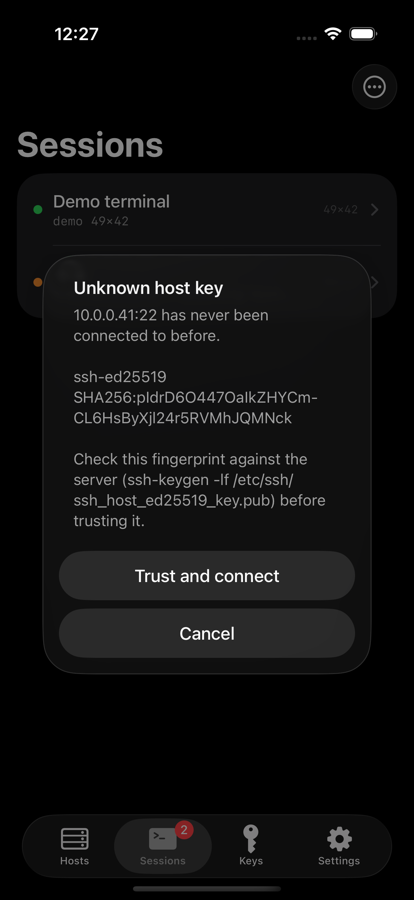 | 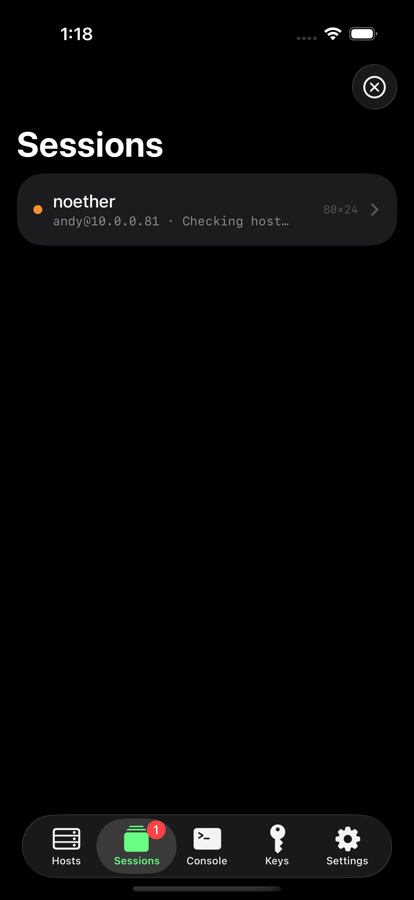 |
| A real first connection to a LAN host. The fingerprint shown matches `ssh-keyscan 10.0.0.41 \| ssh-keygen -lf -` exactly. | The Console tab: `hosts` and `ssh`, resolved against the vault |
| 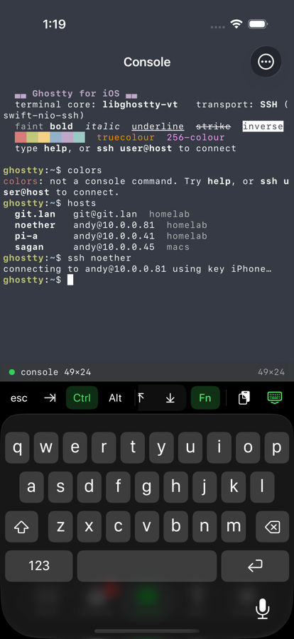 | 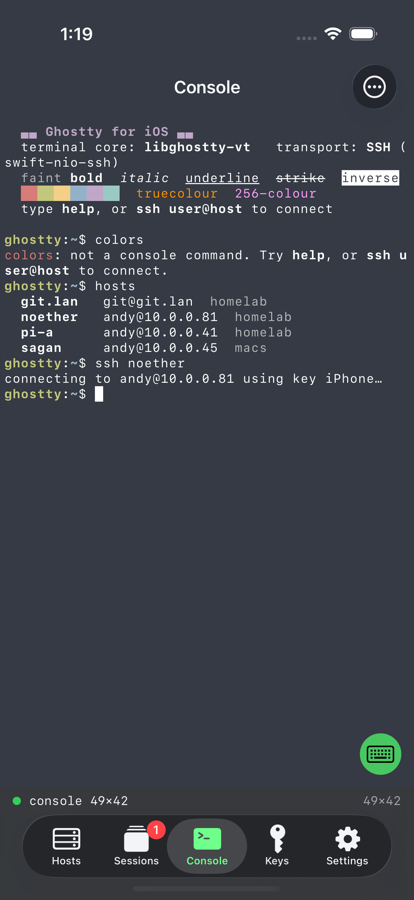 |
| The reorganised key bar with Ctrl armed and the `Fn` row open | The floating keyboard button, shown when the bar is collapsed |
| 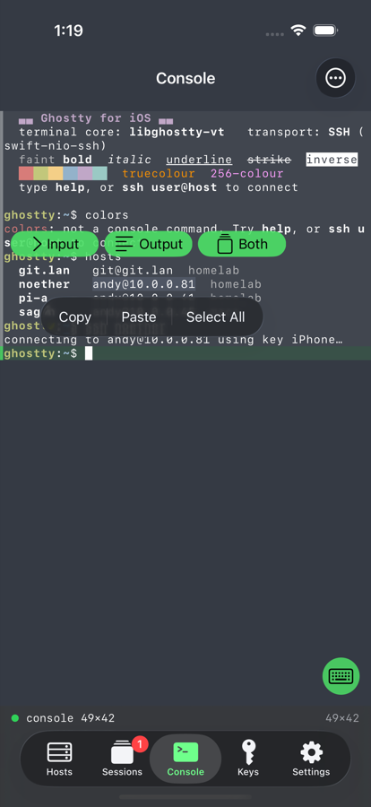 | 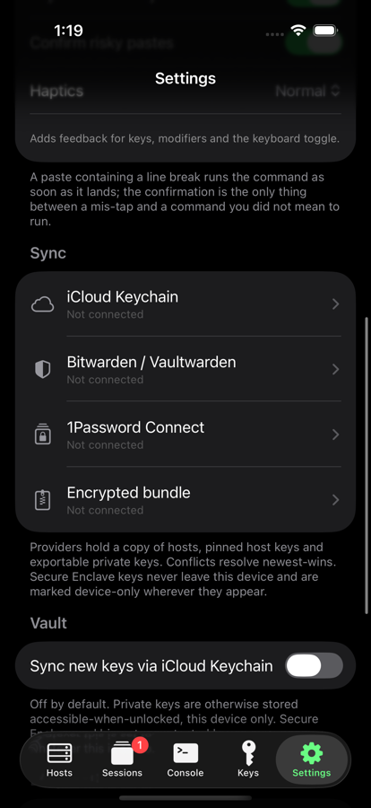 |
| Input/output bands and the selection chips | Sync providers in Settings |
| 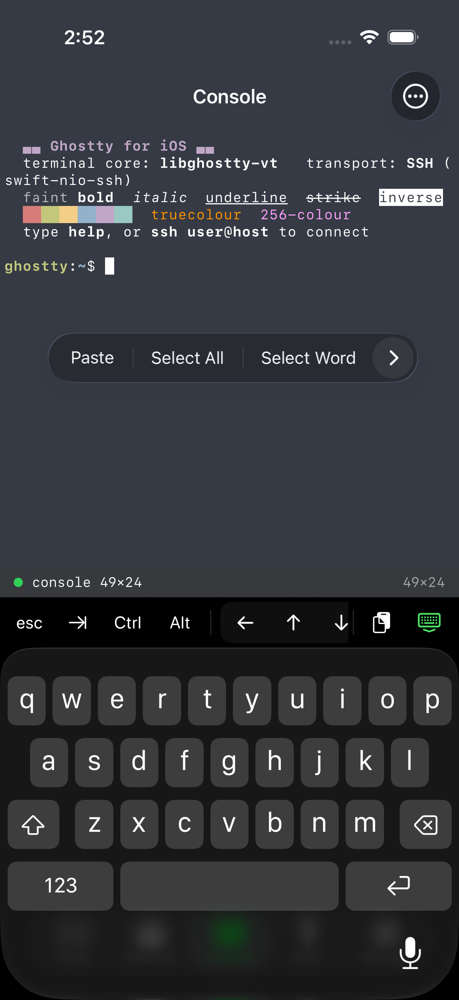 | 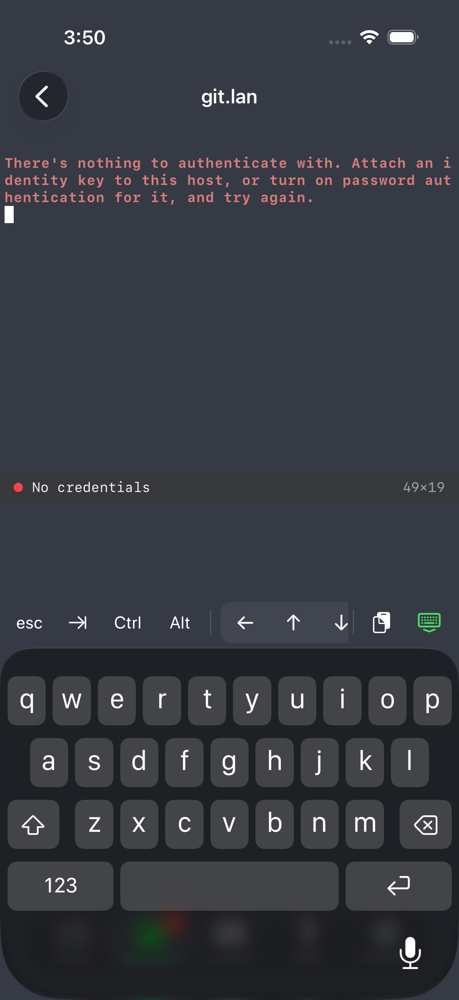 |
| The edit menu on a stationary long press — Paste, Select All, Select Word, and the input/output selections behind the chevron | The session status line above the key bar, which is the sole occupant of the row above the keyboard |
| 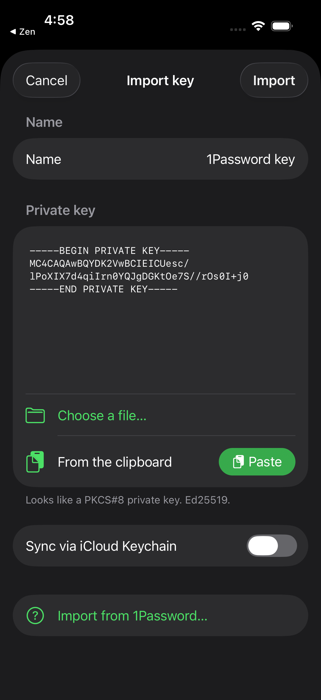 | 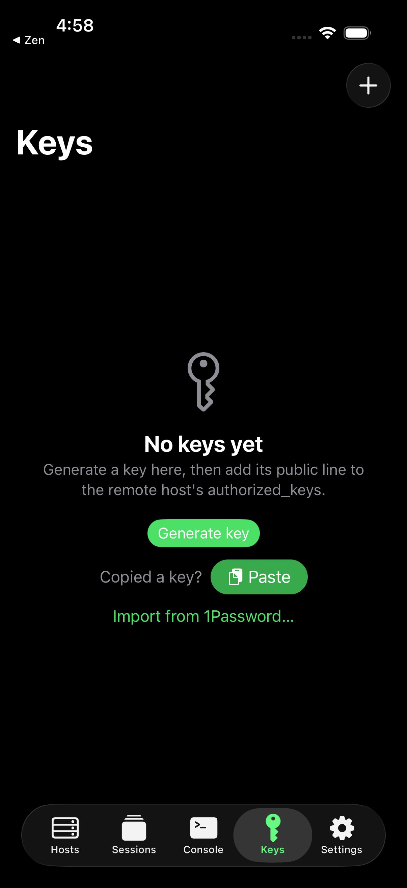 |
| A key pasted from the clipboard: format recognised, name prefilled, one tap from 1Password | The Keys tab offering the import when the clipboard holds something |
| 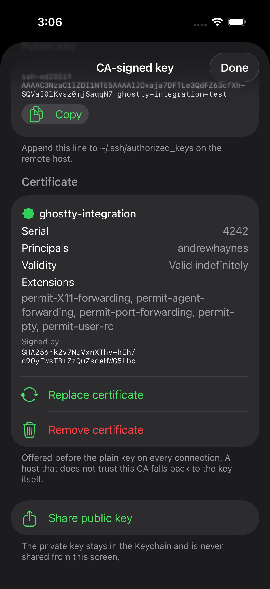 | 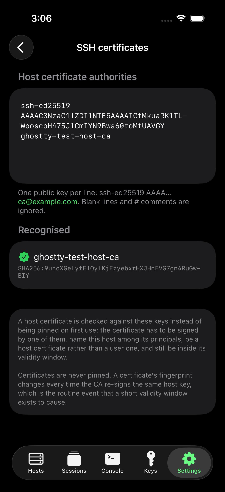 |
| A CA certificate attached to a key: key ID, serial, principals, validity, extensions and the signing CA's fingerprint | The trusted host certificate authorities, parsed and fingerprinted as they are typed |
| 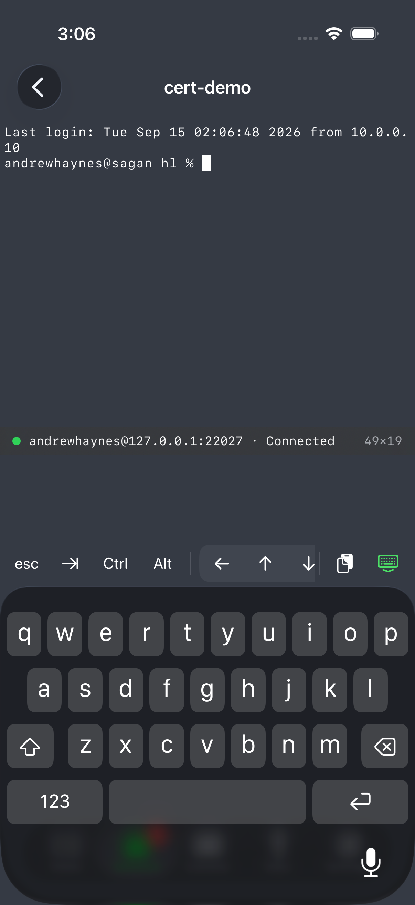 | |
| A shell opened by certificate alone. The server is `Tests/local-sshd.sh`'s `:22027`, which has `AuthorizedKeysFile none` — the key itself is unknown to it, and its log records `Accepted publickey ... ED25519-CERT ... ID ghostty-integration (serial 4242)`. | |

## Toolchain

| | |
|---|---|
| Xcode | 27.0 (27A266a) |
| Swift language mode | 5 |
| Deployment target | iOS 17.0, iPhone + iPad |
| zig (for libghostty-vt) | 0.16.0 |
| xcodegen | 2.46.0 |
| swift-nio-ssh | `and-haynes/swift-nio-ssh`, branch `morton-patches` (a fork of 0.15.0) |
| swift-nio | 2.102.0 |
| swift-crypto | 3.15.1 |
| Bundle id | `com.morton.ghostty` |

## Layout

```
ios/
├── build-libvt.sh              build + stage the xcframework
├── project.yml                 xcodegen spec
├── Sources/
│   ├── GhosttyVT/              Swift wrapper over the libghostty-vt C API
│   ├── TerminalView/           UIKit CoreText grid, key bar, selection helper
│   ├── Console/                the app's own command line
│   ├── SSH/                    swift-nio-ssh client, TOFU, certificates, auth
│   ├── Vault/                  identities, hosts, known hosts, Keychain
│   ├── Sync/                   sync engine + iCloud/Bitwarden/1Password/bundle
│   ├── Haptics/                the haptics service
│   ├── Theme/                  colour schemes
│   └── App/                    SwiftUI screens
└── Tests/
    ├── GhosttyTests/           unit tests (VT, key encoding, vault, TOFU)
    ├── GhosttyUITests/         drives the app, captures the screenshots
    └── local-sshd.sh           real sshd instances on loopback to test against
```

### Testing against a real Vaultwarden

The homelab runs Vaultwarden at `https://vault.lan` (health: `/alive`). Its
unauthenticated `POST /identity/accounts/prelogin` was used to confirm the
real-world shape of the KDF response used in the test fixtures. There is **no
account available to this repo**, so the Bitwarden crypto is tested against
published test vectors and recorded `prelogin` / `sync` fixtures rather than a
live login. Nothing in the test suite touches the network.
